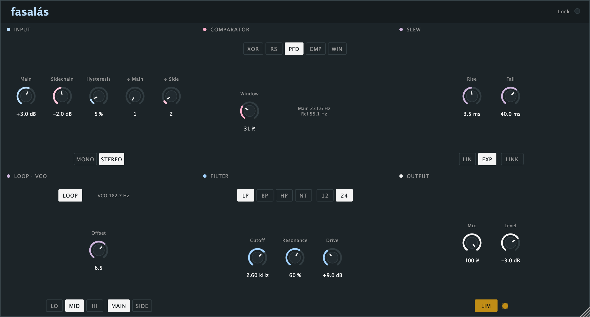

# Fasalás

A phase-comparator audio effect, after the Doepfer A-196 PLL. VST3 / AU /
standalone for macOS.

The A-196 compares its own oscillator against an external signal in one of
three phase comparators, then runs the result through a low-pass filter to
generate a control voltage — the module is a phase-locked loop. Fasalás keeps
the comparators and the loop but puts your track in the oscillator's place:
your audio goes into comparator input 1, a sidechain signal into input 2, and
the comparator's own output — not a filtered control voltage — becomes the
sound. That output runs through a slew stage (the module's own loop filter,
generalised to separate rise and fall) and then a resonant 12/24 dB multimode
filter. Switch on Loop and the module's real signal path comes back: the slew
output drives an internal oscillator that takes the comparator's place at
input 1, exactly as on the hardware.



## Install

Copy the plug-ins where your host looks for them:

```
VST3  ->  ~/Library/Audio/Plug-Ins/VST3/
AU    ->  ~/Library/Audio/Plug-Ins/Components/
```

### Clear the quarantine

These builds carry an ad-hoc signature, not an Apple Developer ID. macOS flags
anything downloaded from the internet as quarantined, and Gatekeeper then
refuses to load the plug-in — usually **silently**, so it simply never appears
in your host and nothing explains why. Run this once after installing:

```sh
xattr -dr com.apple.quarantine "$HOME/Library/Audio/Plug-Ins/VST3/Fasalás.vst3" "$HOME/Library/Audio/Plug-Ins/Components/Fasalás.component"
```

Then restart your host and rescan. Building from source avoids this altogether
— a plug-in you compile yourself is never quarantined.

### Routing the sidechain

Fasalás declares a second stereo input bus for the sidechain. In Ableton
Live: enable the sidechain's Audio From on the track, choose Fasalás's
"Sidechain" input, and turn Sidechain on. Without anything patched into it,
the sidechain reads as silence — the XOR, RS and PFD comparators then just
pass the squared main signal through, so the plug-in is never silent; CMP and
WIN need something in the sidechain to do anything.

## Controls

### Input

| Control | What it does |
|---|---|
| **Main**, **Sidechain** | Input gain, ±24 dB, ahead of the Schmitt trigger — turn either up to pull edges out of quiet material. |
| **Hysteresis** | The trigger's shared threshold. Higher values ignore low-level noise and small wiggles in the input. |
| **÷ Main**, **÷ Side** | Edge dividers, ÷1–÷16, after the manual's frequency-division patch with the A-163. Gives pseudo-harmonics; also the multiplier when Loop is on. |
| **Mono / Stereo** | Stereo runs two full engines, one per channel, main L against sidechain L and R against R. Mono sums each input to one signal first and runs a single engine into both output channels. |

### Comparator

Three of these are the A-196's own switch positions; CMP and WIN only make
sense once the comparator is fed audio instead of a VCO.

| Mode | Source | Behaviour | Sound |
|---|---|---|---|
| **XOR** | A-196 PC1 | Exclusive-or of the two squared inputs. Locks at harmonics — the manual calls this a fault that can be used for effects. | Ring-mod buzz; goes still and hollow on octaves and fifths. |
| **RS** | A-196 PC2 | RS flip-flop: a main edge sets, a sidechain edge resets. Pulse width tracks the phase offset. | Pulse-width modulation that sweeps as the two pitches drift apart. |
| **PFD** | A-196 PC3 | Edge-triggered tri-state network (CD4046-style). Pushes up when main leads, down when sidechain leads, holds in between. Ignores harmonics. | Stepped, staircase tones; the holds become ramps and plateaus through Slew. |
| **CMP** | new | Plain hysteresis comparator on the raw waveforms — no squaring, no dividers. | Hard fuzz whose timbre follows the sidechain's own waveshape. |
| **WIN** | new | High while the two raw signals sit within ± **Window** of each other. | Sparse gating and grain; Window sets the density. |
| **Window** | | Active only in WIN mode. | |

### Slew

| Control | What it does |
|---|---|
| **Rise**, **Fall** | 0.01 ms – 2 s. This is the A-196's own low-pass filter stage, split into separate rise and fall times. Slow settings glide like portamento; fast settings let the comparator's own jitter and wobble through, which the manual suggests using on purpose. |
| **Shape** | **EXP** is the module's own RC low-pass; **LIN** is a constant-rate limiter, like the A-171 the manual names as an external replacement. |
| **Link** | Ties Fall to Rise. |

### Loop · VCO

Off by default. On, the slew output becomes a linear control voltage for an
internal square-wave oscillator, which takes the comparator's input 1 in
place of your track — the module's actual closed loop.

| Control | What it does |
|---|---|
| **Loop** | On/off. |
| **Range**, **Offset** | The A-196's own table: Range picks the oscillator's bottom frequency (LO 2 Hz, MID 20 Hz, HI 200 Hz), Offset (0–10) picks the top within it (up to 1 kHz / 10 kHz / 20 kHz). |
| **Locks to** | What the oscillator is compared against: **Main** (your track) or **Side** (the sidechain). |
| **÷ Main** | Still active in Loop — divides the oscillator, so it locks at 2×, 3× and up: the manual's frequency-multiplication patch. |

### Filter

| Control | What it does |
|---|---|
| **Type** | Low pass, band pass, high pass, notch. |
| **Slope** | 12 or 24 dB/oct — 24 cascades two stages. |
| **Cutoff**, **Resonance**, **Drive** | Self-oscillates near full resonance. Drive is a soft-clip stage ahead of the filter. |

### Output

| Control | What it does |
|---|---|
| **Mix**, **Level** | Dry/wet and output trim. |
| **Lim** | The house limiter, reused unchanged from Afbökun, Colacut and Cloudius: a stereo-linked peak follower, 2 ms attack, 150 ms release, a 0.92 ceiling and a hard clamp, no lookahead. Off by default. It is the very last thing in the chain, after Mix and Level, so it catches the dry signal too. The lamp beside it lights only while it is actually reducing. |

## How it works

```
MAIN IN ──> condition (gain·schmitt·÷N) ──┐                          ┌── DRY
                                          ▼                          │
                                    COMPARATOR ── SLEW ── FILTER ── MIX ── LIM ── OUT
                                          ▲                    (12/24 dB)
SIDECHAIN ──> condition (gain·schmitt·÷N)─┘

Loop on: SLEW also drives a VCO that takes the comparator's place at MAIN IN
         (reference set by Locks to), and becomes FILTER's input directly.
```

The comparator, slew and filter chain runs 4× oversampled
(`juce::dsp::Oversampling`, polyphase IIR half-band) to keep the comparator's
hard edges from aliasing; the plug-in reports the resulting latency to the
host. A 5 Hz one-pole DC blocker sits after the filter, since PFD's holds and
asymmetric slew times leave DC behind.

## Known limitations (v0.1.0)

- No live oscilloscope. The browser prototype this was designed from had one;
  it's cut from this first native build to ship, and is a planned addition.
- The mode/shape/range/type pill controls don't reflect host automation —
  drag them from the plug-in's own UI and they work correctly, including
  saving with your session, but if a DAW automates one from outside the UI
  the pills won't visually update until you touch them or reopen the editor.
  The continuous knobs (gain, cutoff, mix, …) don't have this limitation.
- No unit tests yet for the five comparator modes.
- Parameters are read once per audio block rather than smoothed per sample,
  so very fast automation of Cutoff or the gains can zipper slightly.

## Build

```sh
cmake -B build -DJUCE_DIR=/Applications/JUCE -DCMAKE_BUILD_TYPE=Release
cmake --build build --config Release -j
```

Needs a JUCE checkout (`-DJUCE_DIR=...` if it isn't at `/Applications/JUCE`).
Pass `-DFASALAS_TOOLS=ON` to also build `panel_shot`, which renders the panel
to `docs/panel.png` without opening a host — used for the screenshot above.
